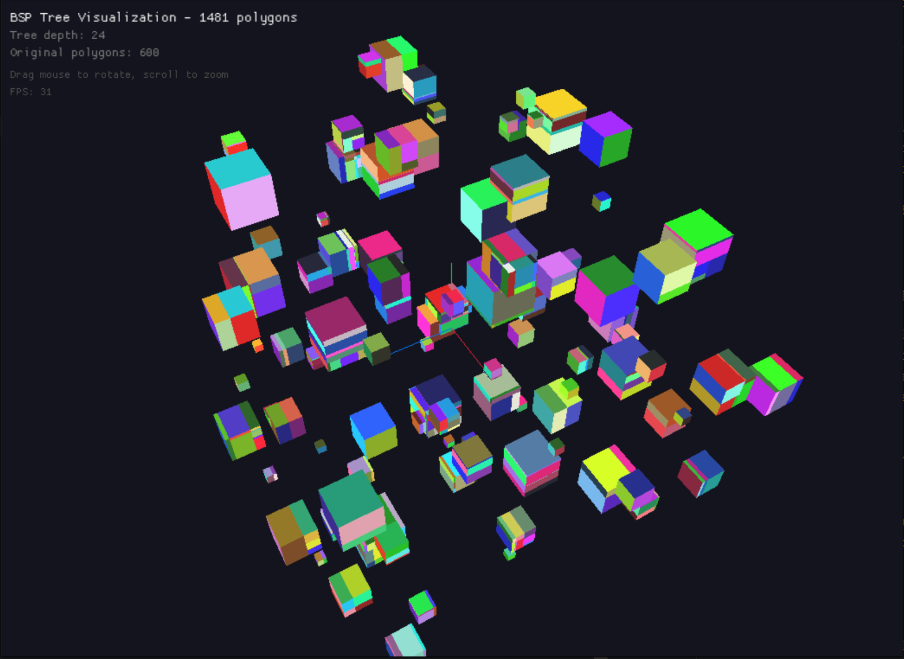
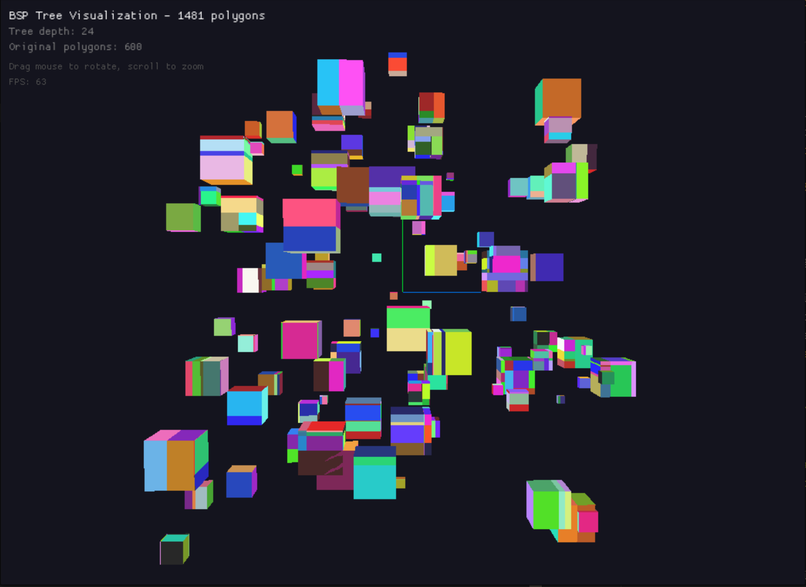
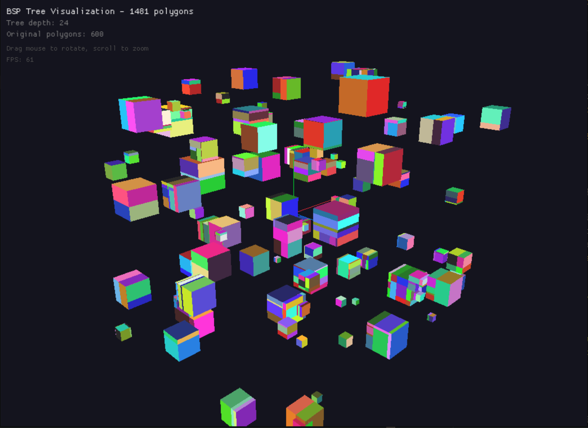
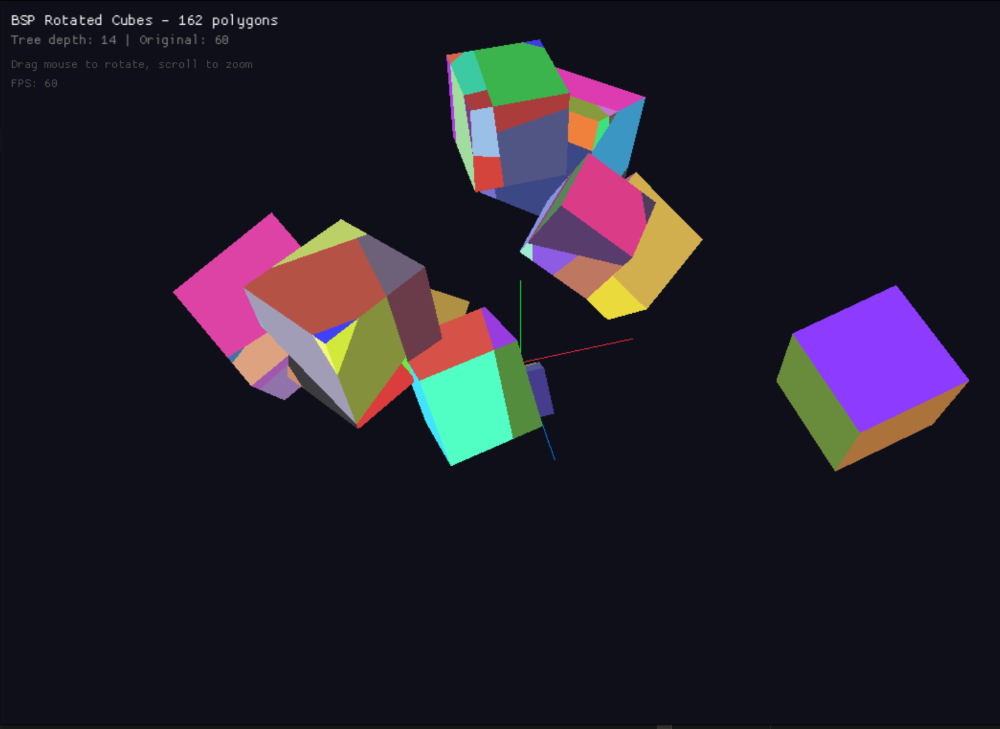
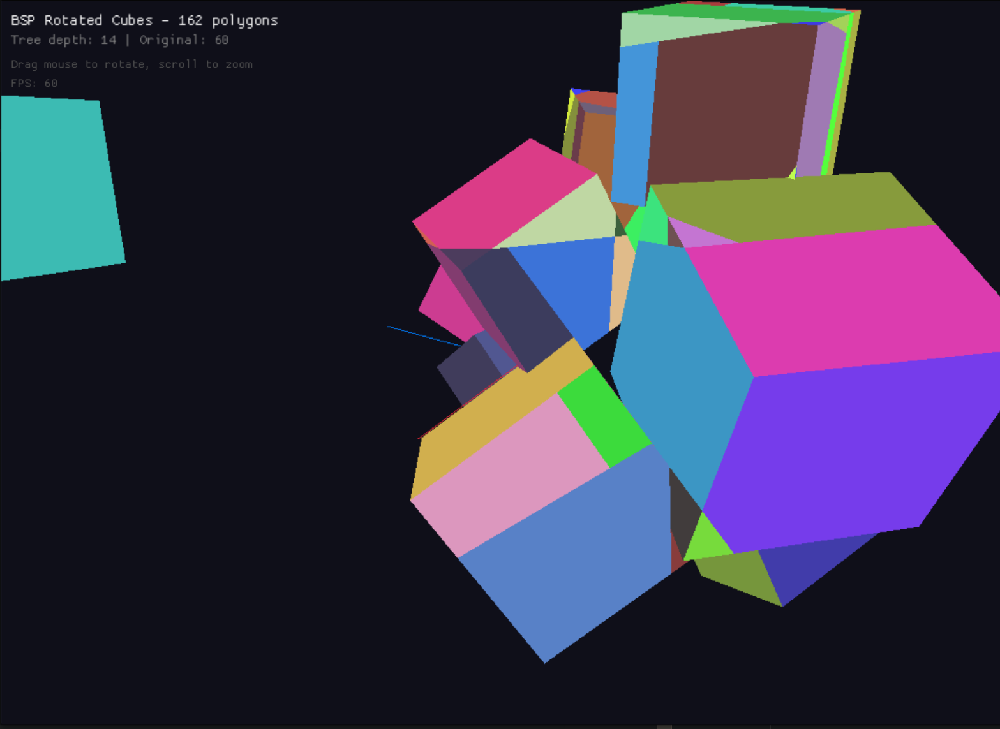

# bsp-tree

A Binary Space Partitioning (BSP) tree implementation in Rust for 3D polygon management.

BSP trees recursively subdivide space using planes, enabling efficient spatial queries and correct back-to-front rendering of overlapping geometry without a depth buffer.

## Screenshots

### Axis-Aligned Cubes
100 cubes with 600 polygons → 1481 after BSP splitting

| | | |
|:---:|:---:|:---:|
|  |  |  |

### Rotated Cubes
10 intersecting cubes with 60 polygons → 162 after BSP splitting

| | |
|:---:|:---:|
|  |  |

## Features

- **Geometric primitives**: `Polygon`, `Triangle`, `Rectangle`
- **Plane operations**: Classification of points and polygons relative to planes
- **Polygon splitting**: `Cuttable` trait for splitting geometry by planes
- **BSP tree construction**: Automatic partitioning with configurable plane selection
- **Ordered traversal**: Front-to-back or back-to-front traversal via `BspVisitor`

## Usage

```rust
use bsp_tree::{BspTree, Polygon};
use nalgebra::Point3;

// Create polygons
let poly = Polygon::new(vec![
    Point3::new(0.0, 0.0, 0.0),
    Point3::new(1.0, 0.0, 0.0),
    Point3::new(0.0, 1.0, 0.0),
]);

// Build the tree
let tree = BspTree::from_polygons(vec![poly]);

assert_eq!(tree.polygon_count(), 1);
```

## Crates

| Crate | Description |
|-------|-------------|
| `bsp-tree` | Core BSP tree library |
| `bsp-viz` | Interactive 3D visualization using [macroquad](https://github.com/not-fl3/macroquad) |

### Running the visualizations

```bash
# Axis-aligned cubes (100 cubes)
cargo run -p bsp-viz

# Rotated intersecting cubes (10 cubes)
cargo run -p bsp-viz --bin rotated
```

## License

Apache-2.0 - See [LICENSE](LICENSE) and [NOTICE](NOTICE) for details.
